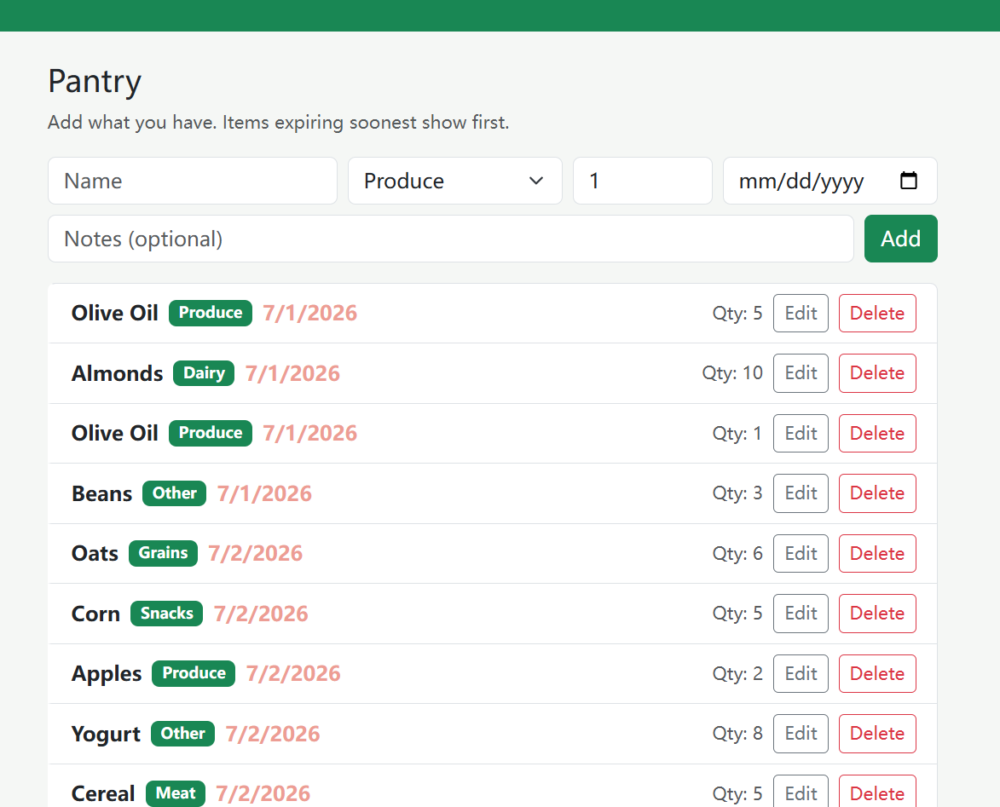

# PantryPal 🥫

A full-stack web app for tracking the food you have at home and managing a simple
shopping list. Add pantry items with a name, category, quantity, purchase date and
notes; browse them on a calendar of shopping days; keep a shopping cart; and get
random "what could I cook?" recipe ideas from what you already own.

- **Author:** Jiachen Zhao
- **Class link:** https://johnguerra.co/classes/webDevelopment_online_summer_2026/
- **Live demo:** https://web-project3-s5w7.onrender.com/
- **design document and mockup:** https://docs.google.com/document/d/14iKH0xFDyhCws_omgvVKZsafctT_EoysBNPQyxWJU1M/edit?usp=sharing 

## Project Objective

Help busy people (students, parents, professionals) keep track of what they have
already bought, avoid buying duplicates, and remember what to buy next — all in
one lightweight app. No external recipe API is used: ideas are generated by
shuffling the user's own pantry items.

## Screenshot



<!-- Take a screenshot of the running app and save it as screenshot.png in the project root -->

## Tech Stack

- **Backend:** Node.js + Express + native MongoDB driver
- **Auth:** Passport (local strategy) with express-session
- **Frontend:** React (function components + Hooks) + Vite, PropTypes, Bootstrap 5 (CSS)
- **No** Mongoose, axios, or the `cors` package are used.

## Collections

- `pantryItems` — food already at home (name, category, quantity, purchase date, notes)
- `groceryItems` — food to buy (name, category, quantity, purchased)
- `recipes` — curated recipes (name, ingredients, minutes, servings, steps)
- `users` — accounts for Passport authentication

Both `pantryItems` and `groceryItems` support full CRUD.

The recipe recommender compares each recipe's ingredients against the pantry and
ranks them, so dishes you can cook right now appear first. Recipes are preloaded
into MongoDB by the seed script — no external recipe API is called.

## Build & Run

### 1. Backend

```bash
cd backend
cp .env.example .env        # then edit .env with your Mongo connection string
npm install
npm run seed                # populate 1000+ synthetic records
npm start                   # starts API on http://localhost:5000
```

### 2. Frontend

```bash
cd frontend
npm install
npm run dev                 # starts React app on http://localhost:5173
```

The Vite dev server proxies `/api` requests to the backend
(see `frontend/vite.config.js`), so sessions work same-origin.

### 3. Lint & Format

```bash
# from either backend/ or frontend/
npm run lint
npm run format
```

## How to Use

1. **Register / Log in** on the landing screen.
2. **Pantry** — browse your food on a calendar of shopping days. Click any day to
   add what you bought then, or to review that day's items. Click a row to read its
   note; use *List* for the full inventory. Edit or delete items as you cook and shop.
3. **Shopping Cart** — add things to buy, adjust quantities, tick items as purchased,
   and remove them after shopping.
4. **Recipes** — see real recipes ranked against your pantry. *Ready to cook*
   needs nothing extra; *Missing 1–2* is one shop away, and one click sends the
   missing ingredients to your Shopping Cart. Click a recipe name for the method.

## License

[MIT](./LICENSE)
